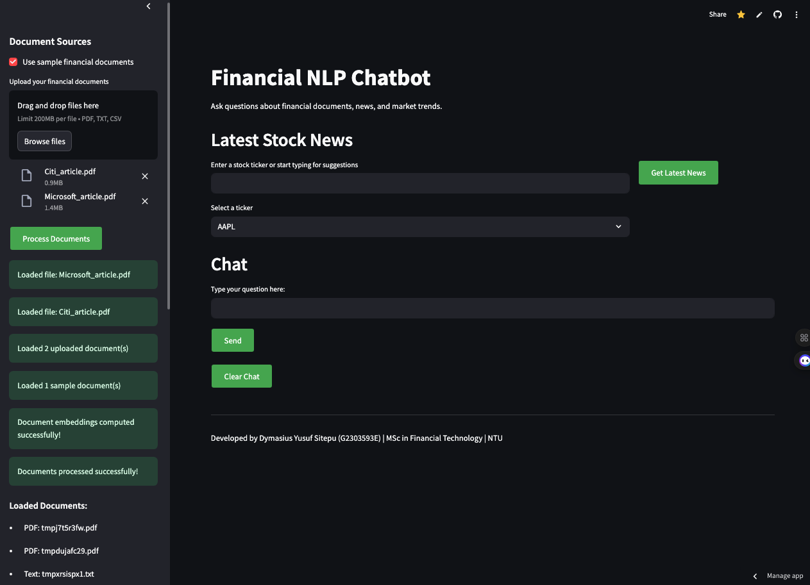

# 🧠 Finance NLP Chatbot with Reinforcement Learning Trading Strategy

This project combines the power of **Natural Language Processing (NLP)** and **Reinforcement Learning (RL)** to build an intelligent trading assistant. It analyzes financial news sentiment, extracts signals, and makes trading decisions using a custom-trained RL agent—all through an intuitive **Streamlit chatbot interface**.

## 🚀 Key Features

- 📊 **Sentiment Analysis**: Using FinBERT to extract market sentiment from financial news.
- 🧠 **RL Trading Agent**: Trained with PPO to act on market sentiment and price signals.
- 💬 **Interactive Chatbot**: Retrieval-augmented generation (RAG) chatbot with context-aware responses and financial document lookup.
- 📈 **Technical Indicators**: Incorporates SMA, EMA, RSI, MACD for enhanced decision-making.
- 🌐 **Live News Integration**: Fetches news from NewsAPI, Yahoo RSS, and analyst reports.

### 💬 Streamlit Chatbot Interface

## 🛠️ Tech Stack

- Python, PyTorch, Gym
- Stable-Baselines3 (PPO)
- Transformers (FinBERT)
- FAISS for vector search
- Streamlit for UI
- NewsAPI & RSS for live news

## 📂 Datasets Used

- [Massive Stock News Analysis (Kaggle)](https://www.kaggle.com/datasets/miguelaenlle/massive-stock-news-analysis-db-for-nlpbacktests)
- [S&P 500 Financial Data (Kaggle)](https://www.kaggle.com/datasets/yahqaskaluso/s-and-p500-financial-data-2013-2023)
